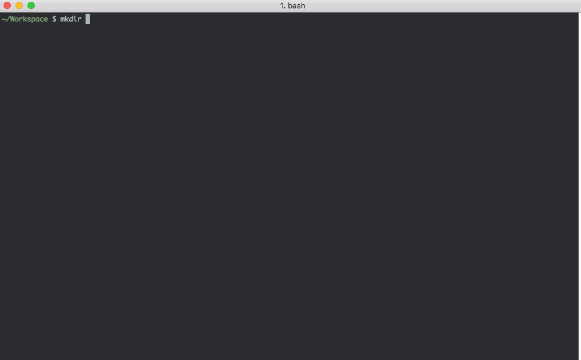

# git-protecc
[](https://travis-ci.org/dcrtantuco/git-protecc)

Custom `pre-commit` and `pre-push` git hooks to prompt user when pushing/committing to master/develop



## Installation
### npm
```
npm install -g git-protecc
```

## Usage
Execute on a git repository _(should be in root for now, where .git is located)_
```
git-protecc
```
This command copies custom `pre-commit` and `pre-push` hooks to current repository

## Protected Branches
- master
- develop
