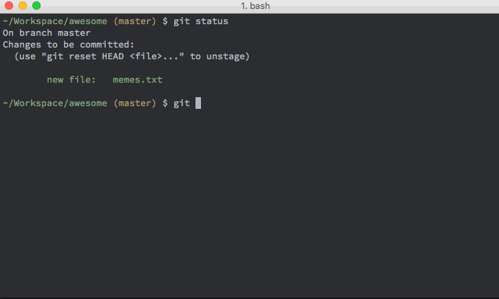

# git-protecc

[](https://travis-ci.org/dcrtantuco/git-protecc)

Custom `pre-push` git hooks to prompt user when pushing to protected branches

git config is used to set protected branches



## Installation

### npm

```
npm install -g git-protecc
```

### yarn

```
yarn add global git-protecc
```

## Usage

### Add branch to protected branches

```
git-protecc branch add <branch>
```

### List all protected branches

```
git-protecc branch
```

### Remove branch from protected branches

```
git-protecc branch remove <branch>
```

## License

MIT
